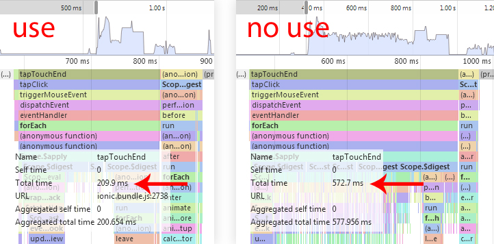

Angular Cache View 
===========

Performance
===========
`ng-repeat` of 1000 elements. Performance 400%

Why use?
===========
Angular, after the change of state, re-compiles dom. rgCacheView caches dom, keeping scope. 
Data binding, events, watchers, stop listening $digest after caching, and not re-compiled, are still in the cache. 
After the restoration of the cache, scope updated and compiled only the changed elements dom.


How use?
===========

```html
<rg-cache-view name="cacheName">
  <div ng-repeat="item in items">
  </div>
</rg-cache-view>
```

Events
===========

| Name           | When called                                              |
| -------------  | -------------                                            |
| $inCacheStart  | Before disconnecting the scope, and the removal of dom.  |
| $inCacheEnd    | After disconnecting the scope, and the removal of dom.   |
| $outCacheStart | Before connecting the scope, and the restoration of dom. |
| $outCacheEnd   | After connecting the scope, and the restoration of dom.  |
```javascript
scope.$on('$inCacheStart', function(event, childScope){
  //Some code
})
```


LICENSE
===========

The MIT License (MIT)

Copyright (c) 2014 rotorgames

Permission is hereby granted, free of charge, to any person obtaining a copy
of this software and associated documentation files (the "Software"), to deal
in the Software without restriction, including without limitation the rights
to use, copy, modify, merge, publish, distribute, sublicense, and/or sell
copies of the Software, and to permit persons to whom the Software is
furnished to do so, subject to the following conditions:

The above copyright notice and this permission notice shall be included in all
copies or substantial portions of the Software.

THE SOFTWARE IS PROVIDED "AS IS", WITHOUT WARRANTY OF ANY KIND, EXPRESS OR
IMPLIED, INCLUDING BUT NOT LIMITED TO THE WARRANTIES OF MERCHANTABILITY,
FITNESS FOR A PARTICULAR PURPOSE AND NONINFRINGEMENT. IN NO EVENT SHALL THE
AUTHORS OR COPYRIGHT HOLDERS BE LIABLE FOR ANY CLAIM, DAMAGES OR OTHER
LIABILITY, WHETHER IN AN ACTION OF CONTRACT, TORT OR OTHERWISE, ARISING FROM,
OUT OF OR IN CONNECTION WITH THE SOFTWARE OR THE USE OR OTHER DEALINGS IN THE
SOFTWARE.
